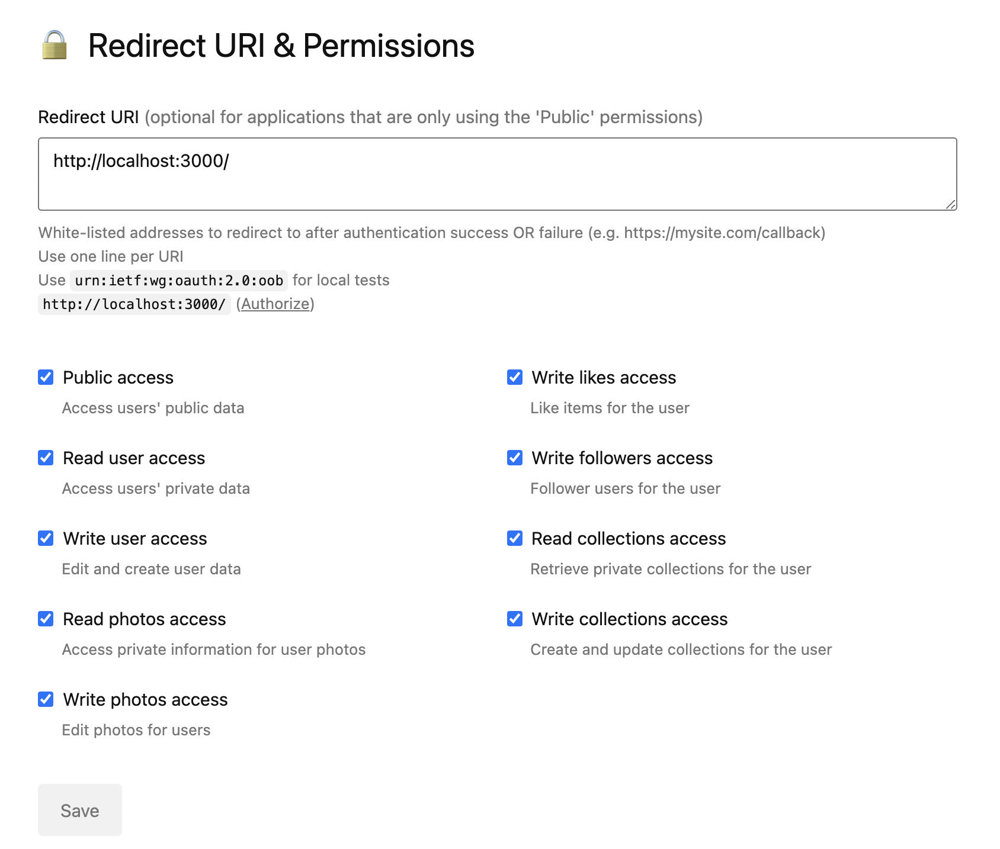

# jazz-pixels-test
* Yarn install
* Create an .env file with REACT_APP_SECRET=(your secret key) and REACT_APP_ACCESS=(your access key)
* Visit https://unsplash.com/oauth/applications. In section URI & Permissions enter the settings as in the screenshot
  
* Yarn start
* Visit http://localhost:3000/

